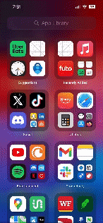

Original App Design Project - README Template
===

# Music Discovery

## Table of Contents

1. [Overview](#Overview)
2. [Product Spec](#Product-Spec)
3. [Wireframes](#Wireframes)
4. [Schema](#Schema)

## Overview

### Description

This app will show users previews of songs on the Billboard Hot 100

### App Evaluation

[Evaluation of your app across the following attributes]
- **Category:**
- **Mobile:**
- **Story:**
- **Market:**
- **Habit:**
- **Scope:**

## Product Spec

### 1. User Stories (Required and Optional)

**Required Must-have Stories**

* Create Table View
* Table is able to display Billboard Hot 100 songs
* Table Cell is altered to Display Name, Artist, and Rank
* Spotify API is able to find song
* Song Preview is displayed in the cell and is able to play preview
* Detail Screen that shows all info on song and plays the preview
* Third Screen showing the top 100 artists

**Optional Nice-to-have Stories**

* Another detail screen that displays info about the artist
* Ability to choose genre of songs
* Detail Screen showing info about the artists from the top 100 artists
* Create music player inside of the App

### 2. Screen Archetypes

- [X] Main Screen - With Top Songs
* Create Table View
* Table is able to display Billboard Hot 100 songs
* Table Cell is altered to Display Name, Artist, and Rank
  
- [X] Detail Screen with more info about the song and with the preview
* Spotify API is able to find song
* Song Preview is displayed in the cell and is able to play preview

* - [X] Artits Screen with the top 100 artists
* Third Screen showing the top 100 artists

* - [ ] Create music player inside of the App (Not enough time)

### 3. Navigation

**Tab Navigation** (Tab to Screen)

* Home Screen (Songs)
* Artists Screen

**Flow Navigation** (Screen to Screen)

- [X] Home
* Song Detail Screen w/ Preview

## Wireframes

### [BONUS] Digital Wireframes & Mockups
https://www.figma.com/file/UXOr6Lf3KHDvQZSKNiwEuV/iOS-App-Wireframes-(Community)?type=design&node-id=431%3A1048&mode=design&t=Byt3BIt7I4AB2u4F-1

### [BONUS] Interactive Prototype
https://www.figma.com/proto/UXOr6Lf3KHDvQZSKNiwEuV/iOS-App-Wireframes-(Community)?type=design&node-id=431-1049&t=to91S54rovvnJVRd-1&scaling=min-zoom&page-id=431%3A1048&starting-point-node-id=431%3A1049&mode=design

## Walkthrough

### Networking

- Home Screen Requests Billboard 100 API
- Song Detail request Spotify API
- Artist Screen request Billboard 100 Artist API

